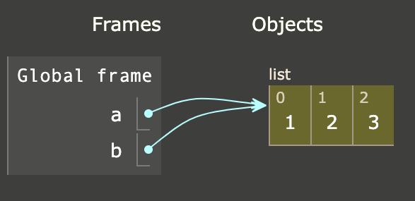
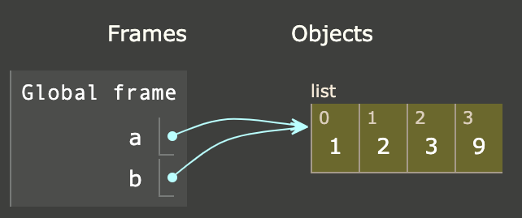
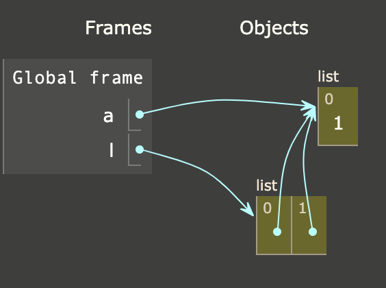

# Особенности работы

Python сохраняет данные в виде ссылок на объекты в памяти. И данное поведение имеет интересную особенность. Иногда
при изменении самих объектов меняется значение переменных неожиданным образом.

Для понимания материала данного урока можно воспользоваться [ресурсом pythontutor](https://pythontutor.com/python-debugger.html#mode=edit), который позволяет визуализировать выполнение кода.

    a = [1,2,3]
    b = a
Запуская данный код мы ожидаем, у нас будет два одинаковых, но независимых списка в переменных a и b

Однако, давайте посмотрим, как выполнение этого кода отображается на pythontutor

Слева мы видим имена переменных - a , b

Справа - объекты в памяти - list содержащий [1,2,3]

Как кажется, если мы выполним добавление элемента к списку, хранящемуся в переменной a, то по идее должно произойти следующее

    a.append(9)
    print(a)     # [1,2,3,9]
    print(b)     # [1,2,3]  !!!! ошибка !!!!!!

однако последняя строка не зря помечена подозрительным комментарием. Хотя выполнение данной программы не приведет к ошибке выполнения, на самом деле произойдет следующее

    a.append(9)
    print(a)     # [1,2,3,9]
    print(b)     # [1,2,3,9]

Почему такое произошло? ведь мы добавляли элемент к списку a, однако поменялся также и список b. Обратим внимание, как данный код будет отображен на pythontutor

Как мы видим, данные переменные ссылаются на один и тот же объект в памяти.( голубые стрелочки показывают ссылки). И при модификации одного из элементов меняется также и второй, так как он ссылается на тот же самый объект

На собеседованиях часто можно встретить задачу:

    a = []
    l = [a,a]
    l[0].append('a')
    Что будет храниться в списке l?    -> [['a'],['a']]

Обратите внимание на визуализацию этого кода

